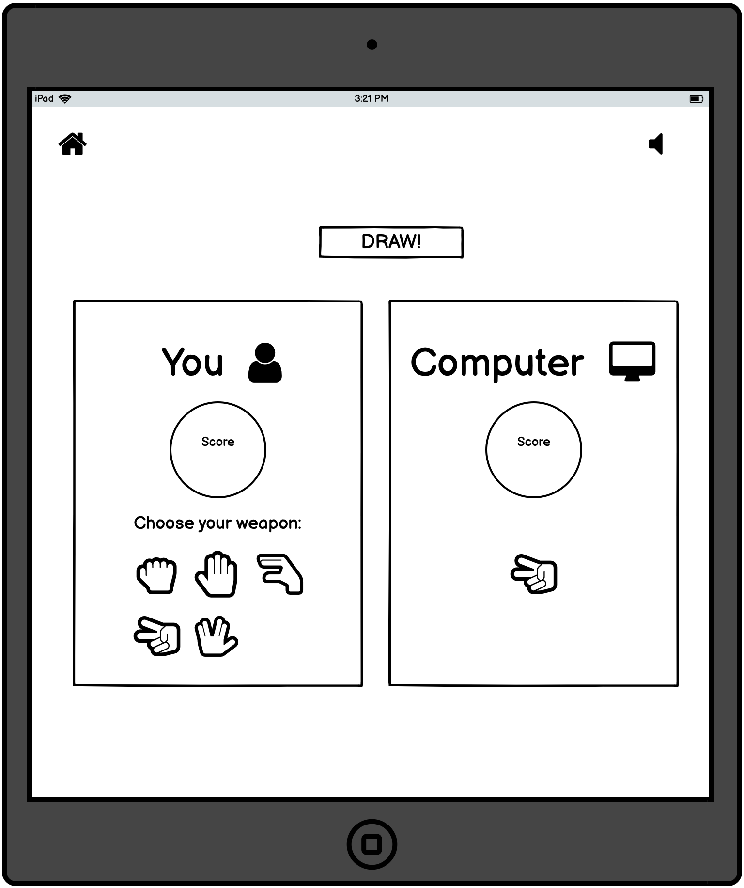

# Rock Paper Scissors Lizard Spock!

## Introduction
Rock Paper Scissors Lizard Spock takes the classic Rock Paper Scissors game and adds 2 new choices, Lizard and Spock. This is a web based game that was created using HTML, CSS and JavaScript. Users of this game will need to make the correct choices in order to be the first to reach 5 points and beat the computer!

This game is targeted towards people who are looking for both a fun and nostalgic challenge.

## Table of Contents

* [User Experience](#Introduction)
    * [Site Goals](#Site-Goals)
    * [User Stories](#User-Stories)
    * [Strategy Plane](#Strategy)
    * [Scope Plane](#Scope)
    * [Structure Plane](#Structure)
    * [Skeleton Plane](#Skeleton)
        * [Wireframes](#Wireframes)
    * [Surface Plane](#Surface)
        * [Design](#Design)
    * [Features](#Features)
    * [Testing](#Testing)
        * [HTML Validation](#HTML)
        * [CSS Validation](#CSS)
        * [JavaScript Validation](#JavaScript)
    * [Deployment](#Deployment)
    * [Credits](#Credits)
    
## UX

### User Stories

* As a user, I want a clear understanding of the game rules and how to win.
* As a user, I want to see my score progress if I am the round winner.
* As a user, I want my opponents score to progress if I am the loser of the round.
* As a user, I want a message to appear, notifying me of the round winner.
* As a user, I want to be able to navigate throughout multiple game screens and back to the home screen.
* As a user, I want to be notified if I have won or lost the game.
* As a user, I want to be able to toggle the game audio on and off.

### Site Goals

* Create a single page site that is easy to navigate through.
* Create a site that is simple in appearance by adding basic colours and layouts.
* Provide the game with some humour for a more meaningful user sexperience.
* Provide the user with feedback as they progress throughout the game.

### Strategy
Rock Paper Scissors Lizard Spock is intended to be a quick but fun to play game. Users get to play the Rock Paper Scissors game we all know and love but now with two new additional choices to make, Lizard and Spock.

### Scope

Features to be included:

* Responsive Design - The game/site should function correctly on screen sizes such as Mobile devices, Tablets, Laptops and Desktops. The design should allow users to have a pleasant experience while playing the game no matter what device they use.

* Navigation elements should be clearly visible to the user so that they can switch between the multiple screens without delay of looking for navigation elements.

* The user should have the choice of choosing which game they would like to play at the home screen.

* Audio elements should be clearly visible to the user so that they can switch between playing with game audio or playing with no audio.

### Structure

* The home screen will provide a list instructions on how to play the game and win.

* The game screen will provide scores for both the user and the computer so that the user can track if they are winning or losing as they progress through each round.

* A message will appear on the screen that will either congragulate the user for winning or display a message of commiserations if they lose.

* An audio file will be played when the game has finished, the sound will either be a satisfying or dissatisfying sound depending on if the user has won or lost the game.

* An icon that will represent the home screen will be available to the user so that they can click it if they would like to revisit the home screen.

* An icon that will represent the audio being on will be available to the user so that they can click it to toggle the game audio on and off.

### Skeleton

* #### Wireframes

I used Balsamiq to create wireframes of how the product would look on different devices. Changes were made to a few of the designs shown below during development.

* Home Screen

* Game Screen

* Bonus Game Screen

* Modals

### Surface

* #### Design

    * Colours:

        - The colours used for this project provide a slight retro feel to the game which is done by setting the background colour to a dark colour while using bright colours for button elements.
         

    * Typography:

        - I have used Google Fonts in order to find a font that would add a retro or game feeling to the project. I decided to use the Changa font as I feel that has achieved the previously discussed game feeling to the project.

    * Icons:

        - Font Awesome was also used in the creation of this project in order to add icons for all of the player options, navigation and audio buttons.

### Features

#### Home Screen

- The Home screen provides users with an eye catching animation of the game icons fading in along with two buttons that allow the user to proceed to the main game or a bonus game.

- Instructions on how to play the game are also clearly visible to the user so that they can understand how to win.

**User stories related to this feature:**

* As a user, I want a clear understanding of the game rules and how to win.

#### Game Screen

- The Game screen is where users can experience the sites main game, Rock Paper Scissors Lizard Spock.

- The user plays against the computer to be the first to win 5 rounds in order to win the game.

- As the user wins, loses or draws throughout each round, a block of text appears notifying them of their round win/loss/draw.

- As the user progresses through each round their score increments if they are the round winner. If the player loses a round the computers score is then incremented.

**User stories related to this feature:**

* As a user, I want to see my score progress if I am the round winner.
* As a user, I want my opponents score to progress if I am the loser of the round.
* As a user, I want a message to appear, notifying me of the round winner.

#### Navigation

- Both game and bonus game screens have a home icon that allows the user to return to the home screen. This allows the user to navigate to play either the main game or bonus game.

**User stories related to this feature:**

* As a user, I want to be able to navigate throughout multiple game screens and back to the home screen.

#### Game Winner

- When the user or computer has reached a score of 5, a message will appear notifying the player if they have won or lost the game. If the user has won the game, a cheerful trumpet sound will play. If the user is not the game winner, an obnoxious booing sound will play.

- The final scores of both players also appear on screen so that the user can see how much they have either beaten or have lost to by the computer.

**User stories related to this feature:**

* As a user, I want to be notified if I have won or lost the game.

#### Audio Toggle Button

- The user has the choice to play the games with or without audio by clicking on the audio symbol.

- When clicked on, the icon changes to a muted icon and also changes its colour to red.

**User stories related to this feature:**

* As a user, I want to be able to toggle the game audio.

### Testing

#### HTML

[W3C HTML validator](https://validator.w3.org/nu/#textarea) was used to validate the sites HTML. 

#### CSS

[W3C CSS Validator](https://jigsaw.w3.org/css-validator/validator) was used to validate CSS used to style the site.

#### JavaScript

[JSHint JavaScript Validator](https://jshint.com/) was used to validate the JavaScript.

#### Browser Testing

The site was tested on multiple browsers such as Chrome, Safari, FireFox, and works as intended.

### Lighthouse Testing

### Deployment

* GitHub Pages:

    1. Log into GitHub.

    2. Select the repository for the Code-Nect project. (https://github.com/Jack112-create/CI-Portfolio-Project-2)

    3. Navigate to and click on 'Settings'.

    4. When the page has redirected, navigate to 'GitHub Pages' and proceed to click on the link.

    5. Select branch to 'Main' from sources dropdown.

    6. Click the generated link to the live site.

### Credits

#### Media

* Am I Responsive is used to display responsiveness on different devices.

* [Free SFX](https://freesfx.co.uk/Default.aspx) provided sounds for the game.

* [Flaticon](https://www.flaticon.com/free-icon/html-coding_13706) provided images of the languages used for the bonus game.

* [Favicon.io](https://favicon.io/) was used to generate the site favicon.